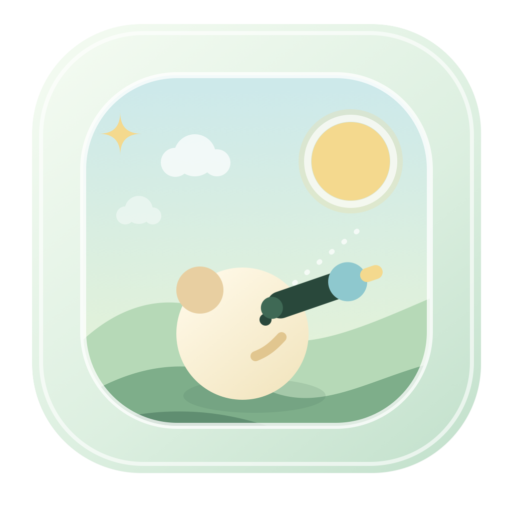

<div align="center">
  

# 眺眺 · Eyes Caller

**把目光放远一点，也把一天过得柔和一点。**

一款遵循 20–20–20 原则的原生 macOS 远眺提醒工具。


</div>

---

## 为什么做「眺眺」

长时间盯着电脑时，我们常常不是不知道应该休息，而是不想被一个强硬的警报打断。

眺眺采用 **20–20–20 原则**：每使用电脑 20 分钟，看向约 6 米外至少 20 秒。它不会用红色警告催促你，也不会连续弹出通知；它只是把一次休息变成一扇安静的小窗。

> 设计目标不是让你完成更多任务，而是让眼睛在任务之间得到一点空间。

| 20 分钟 | 约 6 米 | 20 秒 |
|:---:|:---:|:---:|
| 安心专注 | 把目光放远 | 给眼睛放松 |

## 设计理念

### 温柔，而不是强制

每个工作周期只提醒一次。若暂时不在电脑前，眺眺会停在等待状态，不会累计或轰炸通知。

### 动画应该帮助理解

云朵从窗口外缓慢飘入，鼠标移入花园时产生轻微景深；远眺完成后，色调和场景共同变化。所有动效都服务于“开始、等待、完成”三个时刻，而不是单纯装饰。

### 白天明快，夜晚护眼

白天使用薄荷绿、雾白和日光黄；夜晚切换为深青绿、月光蓝和暖黄。太阳落下、月亮升起、星点和萤火渐显，让主题变化成为一段连贯的昼夜过渡。

### 数据属于用户

远眺次数和主题偏好只保存在当前 Mac 的 UserDefaults 中。没有账号、服务器、追踪器或云端上传。

## 功能一览

- **20 分钟专注计时**：完成远眺后开始下一轮；
- **20 秒远眺引导**：环形倒计时结束后以明显变色提示完成；
- **两种提醒方式**：仅系统通知，或系统通知 + 轻量弹窗；
- **菜单栏常驻**：关闭主窗口后继续后台运行，Dock 图标自动隐藏；
- **昼夜模式**：支持手动切换，以及自定义时间自动切换；
- **远眺花园**：太阳、月亮、云朵、星点、萤火与鼠标景深；
- **远眺足迹**：最近 12 周热力格、今日次数、累计次数与陪伴天数；
- **本地优先**：统计和偏好不离开你的电脑；
- **辅助功能**：支持 macOS“减少动态效果”和较大字体。

## 一次完整的远眺

```text
专注 20 分钟
      ↓
收到一次轻柔提醒
      ↓
点击「开始远眺」
      ↓
看向约 6 米外 20 秒
      ↓
花园变色，完成本轮
      ↓
自动开始下一个 20 分钟
```

## 安装

> [!IMPORTANT]
> 当前版本处于开发预览阶段，尚未使用 Developer ID 签名或 Apple 公证。建议先在自己的 Mac 上构建和体验。

### 方式一：构建普通 macOS App（推荐）

环境要求：

- macOS 13 或更高版本；
- Swift 6；
- Xcode Command Line Tools 或完整 Xcode。

```bash
git clone git@github.com:Nu1sance/Eyes-Caller.git
cd Eyes-Caller
./Scripts/build-app.sh release
open dist/EyesCaller.app
```

构建结果位于：

```text
dist/EyesCaller.app
```

安装到当前用户的应用目录：

```bash
mkdir -p ~/Applications
rm -rf ~/Applications/EyesCaller.app
ditto dist/EyesCaller.app ~/Applications/EyesCaller.app
open ~/Applications/EyesCaller.app
```

安装后可以在 Finder 的“应用程序”或 Spotlight 中搜索 **EyesCaller** / **眺眺**。

### 方式二：快速开发运行

```bash
swift run EyesCaller
```

这种方式适合开发，但它启动的是裸可执行文件：

- macOS 不会为它提供正式 App 身份；
- 系统通知不可注册，眺眺会自动使用小弹窗兜底；
- Dock 可能先把进程显示为 `exec`。

若要验证通知、图标和正常安装体验，请使用 `dist/EyesCaller.app`。

## 使用方法

### 开始与完成远眺

1. 打开眺眺，20 分钟计时自动开始；
2. 到时后点击系统通知或小弹窗；
3. 点击 **开始远眺**，将视线移向约 6 米外；
4. 20 秒结束后，页面会明显变色并播放可选提示音；
5. 下一轮专注计时自动开始。

### 在后台运行

- 点击左上角红叉：隐藏主窗口和 Dock 图标，但不退出；
- 点击顶部菜单栏的叶片与小太阳图标：打开眺眺菜单；
- 选择 **显示眺眺**：恢复主窗口；
- 选择 **立即远眺**：随时开始一次 20 秒远眺；
- 选择 **退出眺眺**：真正结束程序。

### 设置提醒

设置面板提供：

- **仅系统通知**：更安静，提醒保留在通知中心；
- **通知 + 小弹窗**：更容易被注意到；
- **完成提示音**：20 秒结束时播放轻柔声音。

如果通知权限被拒绝或系统通知不可用，眺眺会自动使用小弹窗，避免完全错过提醒。

### 昼夜模式

- 主界面顶部的太阳/月亮按钮可以立即切换；
- 设置中可开启自动切换；
- 默认 `08:00` 进入白天，`20:00` 进入夜晚；
- 两个时间都可以自行修改；
- 自动模式下手动切换会临时保持到下一个计划时间点；
- 主窗口隐藏后，定时切换仍然有效。

### 远眺足迹

点击主界面顶部的格子按钮打开统计：

- 每个格子代表一个自然日；
- 颜色按当天完成 `0 / 1 / 2 / 3 / 4+` 次逐渐加深；
- 鼠标停在格子上可查看日期和具体次数；
- 只有完整完成 20 秒才会计数；
- 同时显示陪伴天数、今日次数和累计次数。

## 隐私

眺眺不包含账号系统，也不会上传使用记录。

本地保存内容：

| 内容 | 存储位置 |
|---|---|
| 远眺统计 | `com.eyescaller.statistics` UserDefaults suite |
| 昼夜偏好 | `com.eyescaller.preferences` UserDefaults suite |
| 提醒方式与声音 | 当前 App 的 UserDefaults |

## 常见问题

<details>
<summary><strong>按下红叉后，程序是不是退出了？</strong></summary>

没有。红叉表示隐藏到菜单栏。只有菜单栏中的“退出眺眺”才会结束进程。

</details>

<details>
<summary><strong>用户不在电脑前时，提醒会反复弹出吗？</strong></summary>

不会。每个周期只提醒一次，然后停在等待状态。电脑睡眠期间错过多个周期也不会补发多条通知。

</details>

<details>
<summary><strong>为什么使用 swift run 时没有系统通知？</strong></summary>

UserNotifications 需要正式 `.app` 的 Bundle Identifier。请使用 `./Scripts/build-app.sh release` 构建并打开 `dist/EyesCaller.app`。

</details>

<details>
<summary><strong>为什么下载到另一台 Mac 后出现安全提示？</strong></summary>

当前构建只有 ad-hoc 签名，尚未经过 Developer ID 签名和 Apple 公证。公开发布前需要完成正式签名、公证与 Gatekeeper 验证。

</details>

## 开发

```bash
# Debug
swift build

# Release
swift build -c release

# 本地 App Bundle
./Scripts/build-app.sh release
```

项目结构和不可破坏的行为约束请阅读 [AGENTS.md](AGENTS.md)。

图标源稿位于 `Assets/`，运行时资源位于 `Sources/EyesCaller/Resources/`。

## 当前状态

这是一个可日常试用的 **Developer Preview**。目前尚未包含：

- 登录时自动启动；
- 自动更新；
- Developer ID 正式签名与 Apple 公证；
- 正式 DMG 安装包；
- 账号、云同步和跨设备统计。

如果你准备公开分发，请先完成签名与公证，不要把 `dist/EyesCaller.app` 当作已认证的正式发行包。

---

<div align="center">

愿每一次抬头，都能看见一点更远的地方。 🌿

</div>
